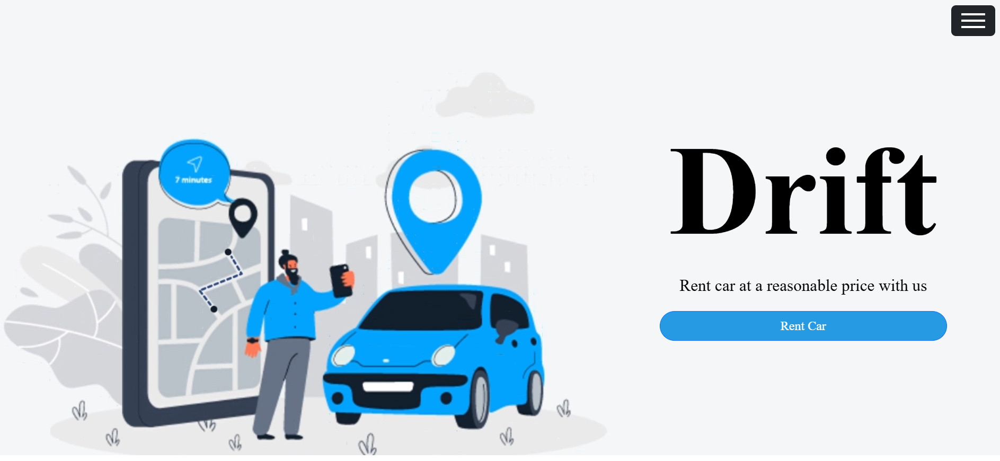
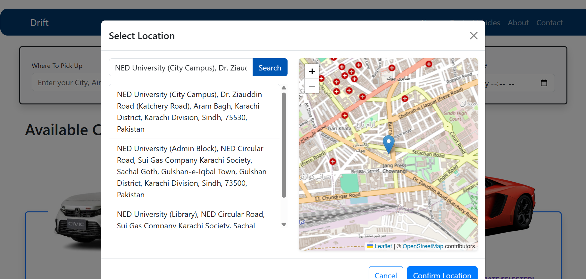
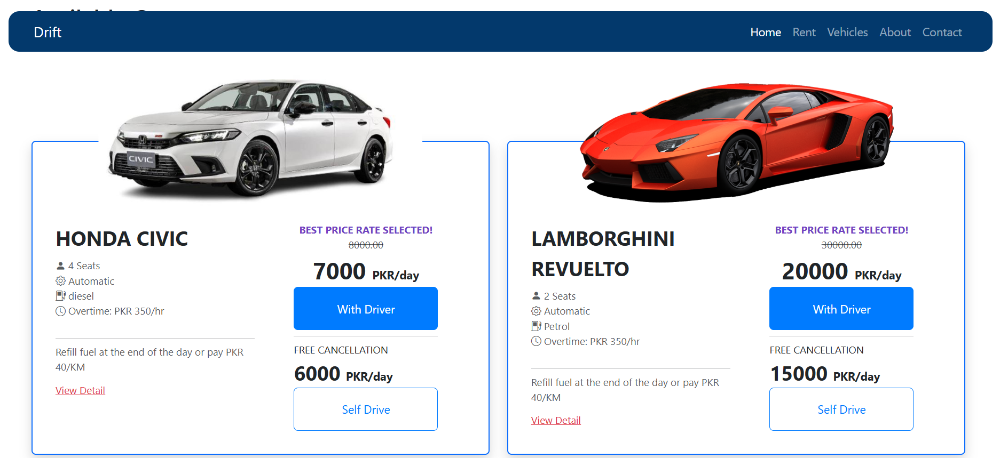
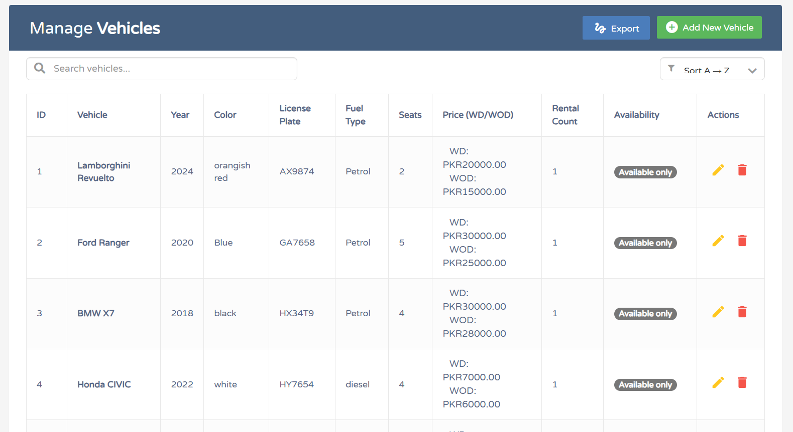
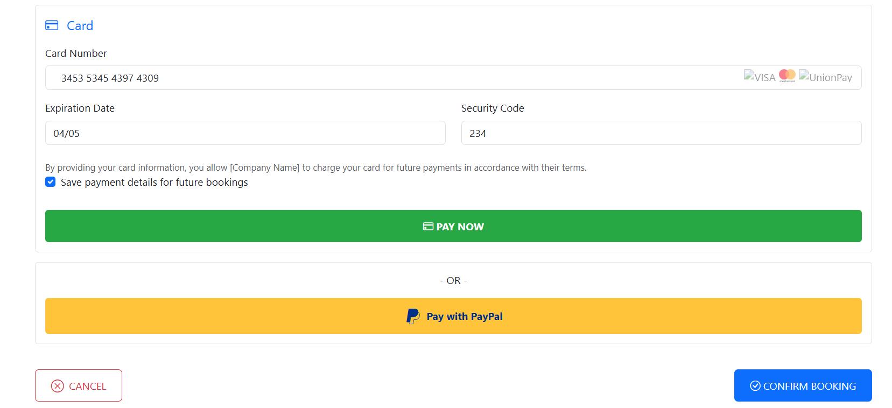
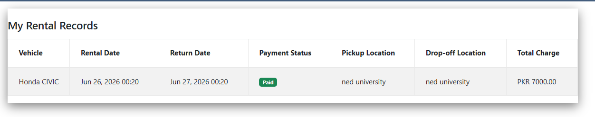

# Drift 
## (Car Rental Management System)



A modern car rental management system built with **Python, SQLite, Bootstrap, and Object-Oriented Programming (OOP)** principles. Drift provides a complete vehicle rental experience for customers while offering powerful management tools for administrators.

## Overview:

Drift streamlines the car rental process by allowing users to browse vehicles, manage bookings, make payments, and track rental history. Administrators can efficiently manage vehicles and monitor rental activities through a dedicated dashboard.

## Features

### Customer Features:

* User registration and secure login
* Browse available vehicles
* Rent cars with a simple booking process
* Add and manage account balance
* Multiple payment options:

  * Wallet Balance
  * Card Payment
  * PayPal
* Update profile information
* Upload profile picture
* View personal rental history
* Export rental history as PDF
* Interactive pickup location selection using map and API integration

### Administrator Features:

* Add new vehicles
* Delete vehicles
* Manage vehicle inventory
* View rental records of all users
* Monitor rental activities and system usage

## Technology Stack:

| Category     | Technologies                                    |
| ------------ | ----------------------------------------------- |
| Frontend     | HTML, CSS, Bootstrap, JavaScript                |
| Backend      | Python                                          |
| Database     | SQLite                                          |
| Architecture | Object-Oriented Programming (OOP)               |
| Features     | CRUD Operations, Authentication & Authorization |
| Integrations | PayPal, Map APIs                                |
| Utilities    | PDF Generation, File Upload Handling            |

## Application Screenshots:

<details>
  <summary><b>Click to View Screenshots</b></summary>

  ### Landing Page
  

  ### Location Picker & Map Integration
  

  ### Vehicle Catalog
  

  ### Admin Dashboard (Vehicle Management)
  

  ### Secure Checkout & Payment System
  

  ### User Rental History
  
</details>

## Project Structure:

```text
Drift/
│
├── static/
├── templates/
├── screenshots/
├── database/
├── models/
├── utils/
├── app.py
├── requirements.txt
└── README.md
```

## Key Highlights:

* Developed using Object-Oriented Programming for scalability and maintainability.
* Implemented role-based authentication for users and administrators.
* Integrated multiple payment methods including PayPal.
* Added map-based location selection through API integration.
* Generated downloadable PDF rental reports.
* Designed separate workflows for customers and administrators.
* Built a complete CRUD-based vehicle management system.

## Future Enhancements:

* Email notifications and booking receipts
* Advanced vehicle search and filtering
* Personalized vehicle recommendations
* Reservation scheduling system
* Analytics dashboard for administrators
* Enhanced mobile responsiveness

## Contributors:

* **Zerwa Ilyas**
* **Javeria Iftikhar**

## Author:

**Zerwa Ilyas**
Computer Science Student • Python Developer • Backend & Database Enthusiast
